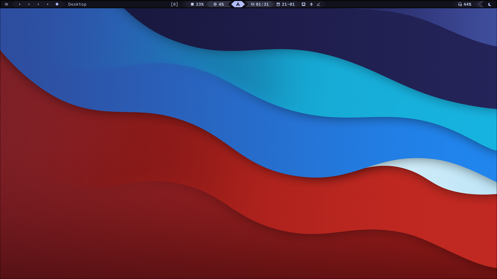

# 🌌 My Hyprland Dotfiles


Моя персональная конфигурация для **Arch Linux (CachyOS)** на базе **Hyprland**.
Система настроена для максимальной производительности, эстетики (Catppuccin Mocha) и удобства разработки.



## 🛠️ Софт и Инструменты

| Компонент | Название | Описание |
|---|---|---|
| **OS** | CachyOS (Arch) | Базовая система |
| **WM** | Hyprland | Оконный менеджер |
| **Bar** | Waybar | Статус бар |
| **Shell** | Zsh / Fish | Командная оболочка |
| **Terminal** | Kitty | Эмулятор терминала |
| **Launcher** | Rofi | Меню приложений |
| **Notifications** | SwayNC | Центр уведомлений |
| **Scratchpads** | Pyprland | Выпадающие окна (Terminal, Telegram) |
| **Theme** | Catppuccin Mocha | Глобальная цветовая схема |

## 🚀 Установка

Для развертывания на новой машине (требуется установленный Git):

```bash
# 1. Создаем директорию разработки (моя структура)
mkdir -p ~/.config-dev

# 2. Клонируем репозиторий
git clone [https://github.com/Nezerkill/dotfiles.git](https://github.com/Nezerkill/dotfiles.git) ~/.config-dev/dotfiles

# 3. Заходим внутрь и запускаем установщик
cd ~/.config-dev/dotfiles
chmod +x install.sh
./install.sh
