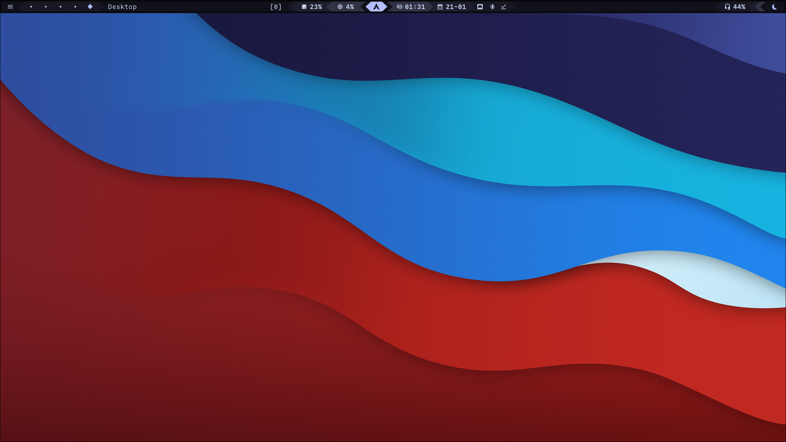

# 🌌 My Hyprland Dotfiles


Моя персональная конфигурация для **Arch Linux (CachyOS)** на базе **Hyprland**.
Система настроена для максимальной производительности, эстетики и удобства разработки.



## 🛠️ Софт и Инструменты

| Компонент | Название | Описание |
|---|---|---|
| **OS** | CachyOS (Arch) | Базовая система |
| **WM** | Hyprland | Оконный менеджер |
| **Bar** | Waybar | Статус бар |
| **Shell** | Zsh / Fish | Командная оболочка |
| **Terminal** | Kitty | Эмулятор терминала |
| **Launcher** | Rofi | Меню приложений |
| **Notifications** | SwayNC | Центр уведомлений |
| **Scratchpads** | Pyprland | Выпадающие окна (Terminal, Telegram) |
| **Theme** | Catppuccin Mocha | Глобальная цветовая схема |

## ⌨️ Keybindings

Основные клавиши управления. Конфиг заточен под **Vim-style** навигацию.

**Mod Key:** <kbd>SUPER</kbd> (Windows Key)

### 🚀 Applications

| Keybinding | Action |
| :--- | :--- |
| <kbd>SUPER</kbd> + <kbd>X</kbd> | Открыть терминал (Kitty) |
| <kbd>SUPER</kbd> + <kbd>E</kbd> | Файловый менеджер (Nautilus) |
| <kbd>SUPER</kbd> + <kbd>B</kbd> | Браузер (Firefox) |
| <kbd>SUPER</kbd> + <kbd>SPACE</kbd> | Меню приложений (Rofi) |
| <kbd>SUPER</kbd> + <kbd>T</kbd> | Telegram (Scratchpad / Pyprland) |
| <kbd>SUPER</kbd> + <kbd>N</kbd> | Центр уведомлений (SwayNC) |

### 🪟 Window Management

| Keybinding | Action |
| :--- | :--- |
| <kbd>SUPER</kbd> + <kbd>Q</kbd> | Закрыть активное окно |
| <kbd>SUPER</kbd> + <kbd>F</kbd> | Полноэкранный режим |
| <kbd>SUPER</kbd> + <kbd>ALT</kbd> + <kbd>V</kbd> | Переключить в плавающий режим (Float) |
| <kbd>SUPER</kbd> + <kbd>C</kbd> | Отцентровать плавающее окно |
| <kbd>SUPER</kbd> + <kbd>G</kbd> | Группировка окон (Togglegroup / Tabs) |
| <kbd>SUPER</kbd> + <kbd>CTRL</kbd> + <kbd>H</kbd>/<kbd>L</kbd> | Переключение внутри группы |

### 🧭 Navigation (Vim Style)

| Keybinding | Action |
| :--- | :--- |
| <kbd>SUPER</kbd> + <kbd>H</kbd> / <kbd>J</kbd> / <kbd>K</kbd> / <kbd>L</kbd> | Фокус на окно (Vim keys) |
| <kbd>SUPER</kbd> + <kbd>SHIFT</kbd> + <kbd>H</kbd> / <kbd>J</kbd> / <kbd>K</kbd> / <kbd>L</kbd> | Перемещение окна (Vim keys) |
| <kbd>SUPER</kbd> + <kbd>1</kbd> - <kbd>5</kbd> | Переключение воркспейса |
| <kbd>SUPER</kbd> + <kbd>SHIFT</kbd> + <kbd>1</kbd> - <kbd>5</kbd> | Отправить окно на воркспейс |
| <kbd>SUPER</kbd> + <kbd>TAB</kbd> | Переключить на последнее окно |

### 🛠️ Utilities & Tools

| Keybinding | Action |
| :--- | :--- |
| <kbd>SUPER</kbd> + <kbd>O</kbd> | **OCR**: Распознать текст с экрана (RU/EN) |
| <kbd>SUPER</kbd> + <kbd>SHIFT</kbd> + <kbd>V</kbd> | История буфера обмена (Cliphist) |
| <kbd>SUPER</kbd> + <kbd>.</kbd> | Эмодзи пикер |
| <kbd>SUPER</kbd> + <kbd>F1</kbd> | Game Mode (Откл. анимации и эффекты) |
| <kbd>SUPER</kbd> + <kbd>M</kbd> | Mute/Unmute микрофона |

### 📦 Git Aliases

| Alias | Command |
| :--- | :--- |
| `grs` | `git restore --staged` |
| `gr` | `git restore` |

### 📸 Screenshots

| Keybinding | Action |
| :--- | :--- |
| <kbd>Print</kbd> | Скриншот всего экрана |
| <kbd>SUPER</kbd> + <kbd>SHIFT</kbd> + <kbd>S</kbd> | Скриншот выделенной области |
| <kbd>SUPER</kbd> + <kbd>Print</kbd> | Скриншот с редактированием (Swappy) |

### 🔄 Submaps (Modes)

| Mode Trigger | Description |
| :--- | :--- |
| <kbd>SUPER</kbd> + <kbd>R</kbd> | **Resize Mode**: Изменение размера окон через HJKL |
| <kbd>SUPER</kbd> + <kbd>0</kbd> | **System Mode**: Блокировка (L), Сон (S), Релоад (R) |
| <kbd>SUPER</kbd> + <kbd>ESC</kbd> | **Wlogout**: Графическое меню выхода |

---
> 💡 **Tip:** Hold `Caps Lock` to act as `Ctrl`, tap for `Esc` (configured via Kanata).

## 🚀 Установка

Для развертывания на новой машине (требуется установленный Git):

```bash
# 1. Создаем директорию разработки (моя структура)
mkdir -p ~/.config-dev

# 2. Клонируем репозиторий
git clone [https://github.com/Nezerkill/dotfiles.git](https://github.com/Nezerkill/dotfiles.git) ~/.config-dev/dotfiles

# 3. Заходим внутрь и запускаем установщик
cd ~/.config-dev/dotfiles
chmod +x install.sh
./install.sh
